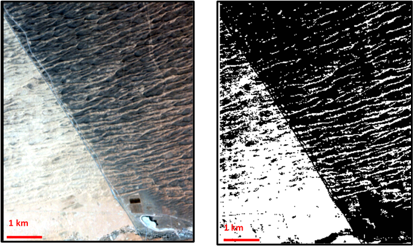

##Introduction

Dunes are a common desert landform that form where there is an abundant supply of sand-sized sediment, strong winds, and conditions that favour deposition. Their morphology is dependent on a variety of factors including changes in wind direction, the availability of sand, and the presence of vegetation, cements, and other binding agents (Laity, 2008). Biological soil crusts (BSC) are communities of cynobacteria, algae, lichens, mosses, microfungi, and other bacteria that weave together throughout the top few millimeters of soil, gluing loose soil particles together (Belnap, 2001). While it has been shown that BSC can lead to sand induration and cause significant attenuation of rates of sediment transport, the association between crusts and dune form is largely unexplored (Hugenholtz, 2011; Amir, 2014). This study hypothesises that the presence of BSC on a dune is correlated with dune morphology and that anchored dunes (ex. parabolic dunes) will more likely have BSCs as they prevent deflation.

In this project spectral data was collected from the study site to identify where the BSCs are present.  This was mapped over a visual image grouping dunes by morphology. Statistical tests were done to determine if there is a correlation between where the BSCs appear and the underlying dune morphology. The spectral analysis were done in ENVI and all datasets were combined and overlain onto each other in ArcGIS. The statistical analyses was done using R-Studio. 


##Study Area

The Negev and Sinai Deserts are considered one geographical desert that links the arid zones of North Africa and Arabia. The separation of these deserts is a result of the political border between Egypt and Israel (Tsoar and Karnieli, 1996). There is a pronounced difference in the spectral reflectance between the Sinai of Egypt and the Negev of Israel (shown in Figure 1) which has been attributed to BSC that covers the stabilized dune sand of the Negev (Karnieli and Tsoar, 1995).  

An analysis of air photos from the 1940s showed that there was no contrast in dune albedo between these deserts until the creation of Israel in 1948. Before this time only Bedouin pastoralists occupied the Negev and they used the land to grow crops and to raise their goats and donkeys who grazed the land. When Israel was formed the Bedouin tribes migrated to the Sinai side of the desert owing to the Israeli military occupation. This led to an increased removal of shrubs for firewood, cultivation, and livestock grazing which caused the shrub density to decrease in the Sinai and increase in the Negev. This allowed biogenic crust to become established on the sand surface of the Negev dunes but not on those in the Sinai (Tsoar and Karnieli, 1996).

This study site was chosen because it allows for a direct comparison between a control desert without BSC (the Sinai) and an experimental desert with BSC (the Negev). These deserts have the same environmental conditions (wind speed and direction from the southwest, temperature, precipitation, sand supply, shrub density etc.) which makes the presence of BSC the only varying variable between them. This study will focus on the border from the coast of the Mediterranean Sea to 50 km inland where the erg ends.


##Data Collection and Correction

Hyperion is a spectral instrument onboard the Earth Observing 1 (EO-1) satellite. It is a hyperspectral instrument that covers the Visual, near-infrared and the short wave infrared (V is/NIR, SWIR) regions of the spectrum with 220 bands with a spatial resolution of 30 m2 (USGS website, 2011). 

There were 8 Hyperion images taken over the selected field site, this was narrowed down to 1 image taken on June 2, 2005 at 8:14 am using the following criteria: 

•	Taken from May-September as this is the dry season and it makes it easier to distinguish BSC from other vegetation because the annuals are dead and the crust and sand are dry
•	Cloud cover of 0-9%
•	Even distribution of Negev and Sinai desert in the image

The downside to using Hyperion data is that they have a low signal to noise ratio which makes it difficult to detect small constituents, like chlorophyll, in the BSC.  The data are not atmospherically corrected so an atmospheric correction program entitled FLAASH had to be used. This program creates an atmospheric model dependent on the date and time the image was taken and where it was taken. A spectral polishing program within FLAASH was used to smooth out any left over noise peaks in the spectrum.

##Mapping Methods


Three methods were used to identify the BSC in the study area. 

1)	Crust Index (CI). This method was developed by Karnieli (1997) using the spectral signature of biological soil crusts; it is the normalized difference between red and blue spectral values.

$$CI=\frac{1-(Red-Blue)}{(Red+Blue)}$$
In CI images the playa areas are dark, interdune crusted areas are gray, and mobile sand dunes are white. Hyperion data were used to construct this index. A mask was then applied to the image in order to emphasize the areas where BSC occurred as shown in Figure 2.




2)	Cyanobacteria Spectral Signature. Field area studies of BSCs in the Negev Desert have been conducted by Karnielei and Tsoar (1995) who identified the spectral signature of these crusts at various field sites. They found that BSCs have spectral features in the visible, near-infrared and short-wave infrared (VIS-NIR_SWIR; 0.4-2.5 mm) including a small chlorophyll absorption feature at 0.68 microns, phycobilins (found in cynobacteria) at 0.62 microns and water absorption bands at 1.4 and 1.9 microns. Due to the poor signal to noise ratio in the Hyperion data the spectral signatures of the BSC could not detected. The spectral signature collected by Hyperion for areas covered with bare sand and those covered by BSC are shown in Figure 3. 


3)	Surface Temperature. Due to the differences in albedo and sediment induration between the Negev and Sinai there will also be a difference in surface temperature which can be used to detect BSC. LandSat 7 has a band that covers the thermal infrared region and will be used to detect temperature changes. A scene collected on May 29, 2005 at 1:00 am was selected because this was the image taken closet to the June 2nd Hyperion image. During this time of the day the BSC will be warmer because it is more indurated and will be able to retain its heat in the early morning. The downside to Landsat 7 imagery is that the scan line corrector is broken on this instrument which causes black lines to appear in the scene. A map showing this temperature is shown in Figure 4.


##Results

The Hyperion data set was used to identify 70 linear dunes in the scene. There are 27 dunes on the Israeli side and 43 dunes on the Egyptian side. More dunes were identified on the Egyptian side as there is a road in this desert that divides these dunes in half.  The average linear length of dunes is 6.7 km in Israel and 3.3 km in Egypt. For each dune the percentage of BSC covering its surface was determined using the crust index method. A sinuosity ratio is used to measure the symmetry/asymmetry of these dunes. Sinuosity ratio (SR) is the ratio of the sinuous length to the straight-line distance of a linear dune as shown in Figure 5. A completely straight dune will have a sinuosity ratio of 1. The SR is measured for each dune in the scene and is plotted against the percent BSC concentration of that dune (Figure 6).


The hypothesis of this project is that linear dunes without BSC will be more sinous than those with it. The simpliest way to test this is to divide the data into two groups: High BSC (>90% BSC coverage) and Low BSC(<5% BSC Coverage). Then set up a null hypothesis that the mean SR between both groups is the same. A Mann-Whitney test is used to test the null hypothesis because it can decide whether the population distributions are identical without assuming them to follow a normal distribution. This test produced a W-value of 15 and a p-value of 1.123 E-14 thus showing that the two populations are different.

A linear regression was used to determine how the percent cover of BSC affects the dune symmetry. The following linear regression best suited the data:

$$SR=1.072-0.0007BSC+error$$

where BSC is measured in percent cover. The standard error on the intercept is 0.0041, the standard error on the slope is 8.33E-4 , and the residual error is 0.031. This regression tells us that an additional 1% coverage of BSC on a dune will lead to a 0.0007 increase in the sinuosity ratio of the dune. 


This study is intrested in the suitability of using thermal infrared spectra converted to surface temperatures to map BSC. To determine the suitability one needs to know if there is a relationship betwwen the percent coverage of BSC on a dune and the average surface temperature of a dune (plotted in Figure 7).  The following linear regression best suited the data:

$$Temp(^O C)=44.8+0.04BSC+error$$

where BSC is measured in percent cover. The standard error on the intercept is 0.127, the standard error on the slope is 0.002, and the residual error is 0.789. This regression tells us that an additional 1% coverage of BSC on a dune will lead to a 0.04 increase in the average surface temperature. 


Please see the appendix for the full statistical analysis. 

##Discussion and Conclusion

Linear dunes align parallel to the dominant winds, in this region this is from the SW, and are modified by secondary winds which causes their symmetry and asymmetry. These are westerly and southwesterly, blowing during winter time, and northerly and northwesterly in the summer time. Linear dunes without BSC are more sinuous than those that have BSC as the wind is able to act freely on the dune which leads to its asymmetric shape.

##References

Amir, R., S. Kinast, H. Tsoar, H. Yizhaq, E. Zaady, and Y. Ashkenazy (2014), The effect of wind and precipitation on vegetation and biogenic crust covers in the Sde-Hallamish sand dunes, J. Geophys. Res. Earth Surf., 119, 437–450.

Belnap, J., & Lange, O. (Eds.). (2001). Biological soil crusts: Structure, function, and management. New York: Springer.

Hugenholtz, C. H., Levin, N., Barchyn, T. E., & Baddock, M. C. (2012), Remote sensing and spatial analysis of aeolian sand dunes: A review and outlook. Earth-Science Reviews, 111(3), 319-334.

Karnieli, A., and Tsoar, H. (1995). Spectral reflectance of biogenic crust developed on desert dune sand along the Israel-Egypt border, Remote Sensing, 16(2), 369-374.

Karnieli, A., Kokaly, R., West, N.E., Clark, R.N., (2001), Remote sensing of biological soil crusts. In: Belnap, J., Lange, O. (Eds.), Biological Soil Crusts: Structure, Function, and Management. Springer-Verlag, Berlin, pp. 431-455.

Laity, J. (2008). Landforms of Accumulation. In Deserts and desert environments. Chichester, UK: Wiley-Blackwell.

Tsoar, H. and A. Karnieli (1996), What determines the spectral reflectance of the Negev-Sinai sand dunes.  Int. J. of Remote Sensing, 17(3).

Hyperion. (2011, December 13). Retrieved March 31, 2015, from http://eo1.usgs.gov/sensors/hyperion

##Appendix

## Setup
First, let's do some preliminary work: setting the workspace, loading libraries and loading data.

```{r load libraries, message=FALSE}
library(ggplot2)
library(dplyr)
library(tidyr)
library(GGally) 
```

The data set contains the sinuosity ratio (SR) and the %BSC coverage (BSC) for each dune in the Negev (Israel) and Sinai (Egypt). There are two additional columns entitled "SR Low BSC" and "SR High BSC" which divides the data into two groups based on the % of BSC. If there is greater than 90% BSC coverage that it is considered high and if the BSC coverage is less than 5% than it is grouped as Low BSC.  There were 43 dunes counted on the Egypt side and 27 dunes on the Israel side. 
```{r load data}
BSC <- read.csv('data/BSC.csv')
summary(BSC)
head(BSC)
```

We want to save all or plots into an images folder.

```{r opts, echo = FALSE}
knitr::opts_chunk$set(
  fig.path = "images/"
)
```

## Preliminary Inspection of Data
Start by plotting the % coverage of BSC against the Sinousoity Ratio for each dune. 
```{r}
ggplot(data=BSC) + geom_point(aes(x=BSC, y=SR, color=Desert)) + ylab('Sinuosity Ratio') + labs(color='Desert') + xlab('% Cover of BSC') + theme(text=element_text(size=12))+ guides(colour = guide_legend(override.aes = list(size=3)))
```

As shown in this plot there is a greater spread in data on the Egyptian side where there is almost no BSC coverage. We can confirm this by looking at the box plots of this data set.
```{r}
ggplot(BSC)+geom_boxplot(aes(x=Desert,y=SR, color=Desert)) + ylab('Sinuosity Ratio') + theme(text=element_text(size=12))
```

## Test mean (BSC)=mean (no BSC)

The hypothesis of this project is that linear dunes without BSC will be more sinous than those with it. The simpliest way to test this is to divide the data into two groups: High BSC (>90% BSC coverage) and Low BSC(<5% BSC Coverage). Then set up a null hypothesis that the mean SR between both groups is the same. 

Look at the box plot of Low BSC against High BSC. 
```{r}
ggplot(BSC)+geom_boxplot(aes(x=BSC.Coverage,y=SR, color=BSC.Coverage)) + ylab('Sinuosity Ratio') +theme(text=element_text(size=12))
```


Let's test the suitability of a t-test by looking at the standard deviations in a summary table. 
```{r}
BSC %>%group_by(BSC.Coverage) %>% summarize(m=mean(SR), s=sd(SR), n=n())
```
The rule of thumb is that if the standard deviations are within an order of magnitude of one another than a t-test can be applied. As shown in the summary table the standard deviations are within one order of magnitude thus a t-test can be applied with a 0.05 significance level.

```{r}
t.test(SR.BSC~BSC.Coverage.2,data=BSC)
```

The results of this t-test tells us that we can reject the null hypothesis and that the average sinuosity ratio between the two groups is statiscally significant.

Even though the standard deviation said it was suitable to do a t-test I am still skeptical because of the box plot distrubution. Are the distrubitions even normal within each group? Let's test this. 

```{r}
#Low BSC coverage histogram
SR_Low_BSC= BSC$SR.Low.BSC
hist(SR_Low_BSC)
```
The Low BSC looks to be a bit positively skewed.

```{r}
#High BSC coverage histogram
SR_High_BSC= BSC$SR.High.BSC
hist(SR_High_BSC)
```
The High BSC is positively skewed.


Let's do a Mann-Whitney U-test; the null hypothesis is still the same from the t-test. 
A Mann-Whitney test assumes that the two data sets are independent and the samples do not affect each other. The great thing about this test is that we can decide whether the population distributions are identical without assuming them to follow a normal distribution.
```{r}
wilcox.test(SR.BSC~BSC.Coverage.2,data=BSC) 
```
This test supports the conclusion of the t-test and that these two populations (Low and High BSC) have nonidentical sinuosity ratios. 

## Correlation between BSC and Sinuosity Ratio

We have established that there is a statistical difference between the sinuosity ratios means between areas with low and high BSC coverage but how does BSC influence the SR? To test this we will need to do a linear regression. 

Start by doing a basic linear regression.
```{r}
# Fit the Model
model <- lm(SR~BSC, data=BSC)
#Print out a summary
summary(model)
```
This is showing a heavy dependence on BSC. But is this a valid model? To test this we will need to look at the residual plots. 
```{r}
plot(model)
```

The most important assumption of a linear regression is that there is a linear relationship between the variables. This is tested in the first resdiual plot. Ideally you would want this line to be horizontal but here it is below the horizontal line so perhaps the data follow an exponential curve and not a linear one. If this assumption is violated than our entire ouput (coefficients, standard error, and t-values) are wrong.

The seond plot tests the assumption that the residuals are normally distributed. This line should be straight. This plot suggests that our residuals have a skewed distribution. 

The third plot tests the assumption that the variance is constant aka homoskedastic. If the variance is constant than the line would be straight. This plot shows that are residuals are not homoskedastic. 

Since our assumptions for (1) normally distributed residuals and (2) homoskedasticity are not perfect than our standard errors and t-values will be off in the model output.

The last plot is displaying leverage against resdiduals. If a data point has a high leverage that it pulls on our model line. This plot can be used to identify outliers. I can think of no scientific reason to exclude any of these data points so I will contintiue to use all of my data points.

Let's examine the possibility that our regression might be a power function. Start by plotting it on a log-log scale.
```{r}
ggplot(data=BSC) + geom_point(aes(x=BSC, y=SR, color=Desert)) + ylab('log(Sinuosity Ratio)') + labs(color='Desert') + xlab('log(% Cover of BSC)') + guides(colour = guide_legend(override.aes = list(size=3)))+ scale_y_continuous(trans = "log") + scale_x_continuous(trans = "log")
```
This looks like it could follow a linear regression. So potentially we could be dealing with a power law relationship that looks like this.
$$\mbox{SR} = \alpha\times{\mbox{BSC}^\beta}$$  
This is not linear, but it suggests that the following regression might make sense: 
$$\log(\mbox{SR}) = a + \beta \times log(\mbox{BSC})$$
$a$ is not quite $\alpha$, rather $a=\log(\alpha)$.  

Let's redo our regression.
```{r}
# Fit the Model
model2 <- lm(log(SR)~log(BSC.No.Zero), data=BSC)
#Print out a summary
summary(model2)
```

As you can see there is a problem. The majority of my data points have a BSC coverage of 0% and you can't take a log of zero. So I will transform this data and replace it zero with 10^-5. 

Look at the residual plots to determine if this model is valid.
```{r}
plot(model2)
```
From the first plot we can tell that we still don't have an ideal linear regression. This will throw off our coefficients, standard error, and t-values. The second plot shows that are resdiuals are still not normally distributed and the third plot shows that they are not homoskedastic. 

This is not a good regression. Let's go back to our first regression it would be better if there was more data about itermediate BSC cover. Let's examine this based on how the BSC interacts with each desert.

First change the desert column to a categorical variable. 
```{r}
BSC$DesertC <- as.factor(BSC$Desert)
```

Now do a linear regression with SR depending on BSC and the interaction between BSC and the desert it is found in with a significance value of 0.05.
```{r}
# Fit the Model
model3 <- lm(SR~BSC+BSC*DesertC, data=BSC)
#Print out a summary
summary(model3)
```
The intercept is the baseline country which is Egypt. 

When the catgorical varible DesertC=0, the regression equation is:
SR= 1.074 - .0012 * BSC

When DesertC=1, the regression equation is
SR=1.074- .013) + (-.0012 + .0006) * BSC

Neither the .013, nor the .0006 is significant, so there is no evidence that DesertC changes the regression.

I'm choosing the first regression (model 1) to be the best model for the following reasons:
1) The log-log model (model 2) was not ideal because the data had to be manipulated to not equal zero for a log function to be applied.
2) Including the desert was shown not to be significant in model 3.


## Correlation between BSC and Surface Temperature

Another part of this project is determining if the surface temperature of a desert can be used to detect BSC. I have taken the average surface temperature of each dune. 

Let's start by looking at a plot of our data. 
```{r}
ggplot(data=BSC) + geom_point(aes(x=BSC, y=Temp, color=Desert)) + ylab('Surface Temp (Degree Celsius)') + labs(color='Desert') + xlab('% Cover of BSC') + theme_set(theme_grey(base_size = 30))+ guides(colour = guide_legend(override.aes = list(size=3))) 
```

Let's do a linear regression on this. 
```{r}
# Fit the Model
model4 <- lm(Temp~BSC, data=BSC)
#Print out a summary
summary(model4)
```
This is showing a heavy dependence on BSC. But is this a valid model? To test this we will need to look at the residual plots. 
```{r}
plot(model4)
```

The first plot shows that this relationship is pretty linear so the first assumption of a linear regression is met. The second plot shows that the residuals do not follow a normal distribution perfectly so there will be a slight error in the standard error and t-value. The third plot shows that the variance is constant. 

This is a good regression. 