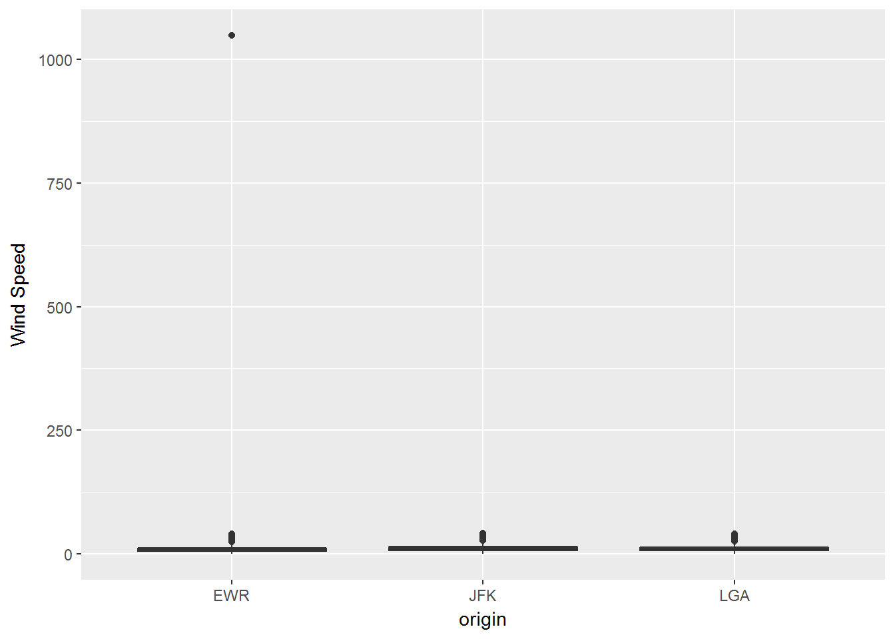
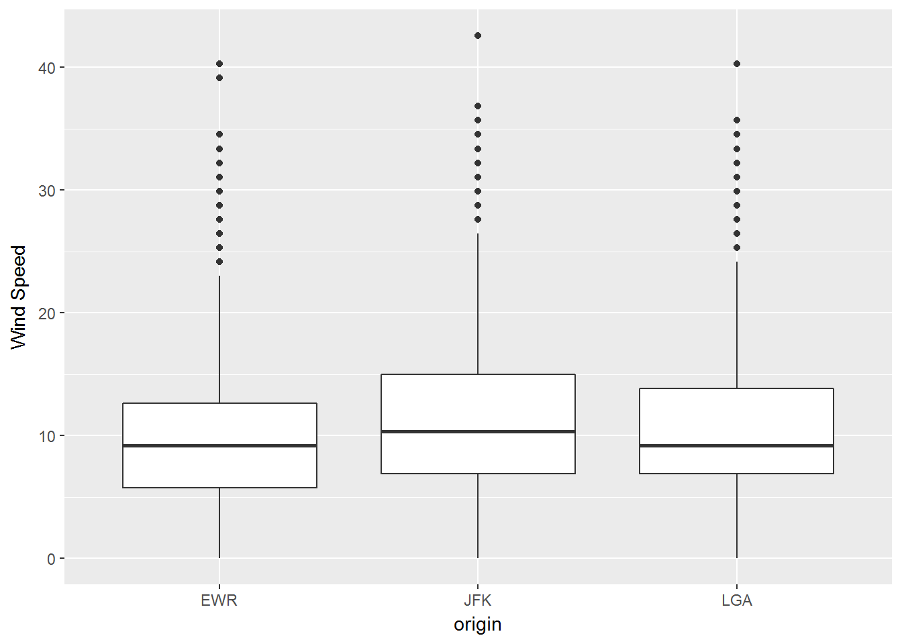
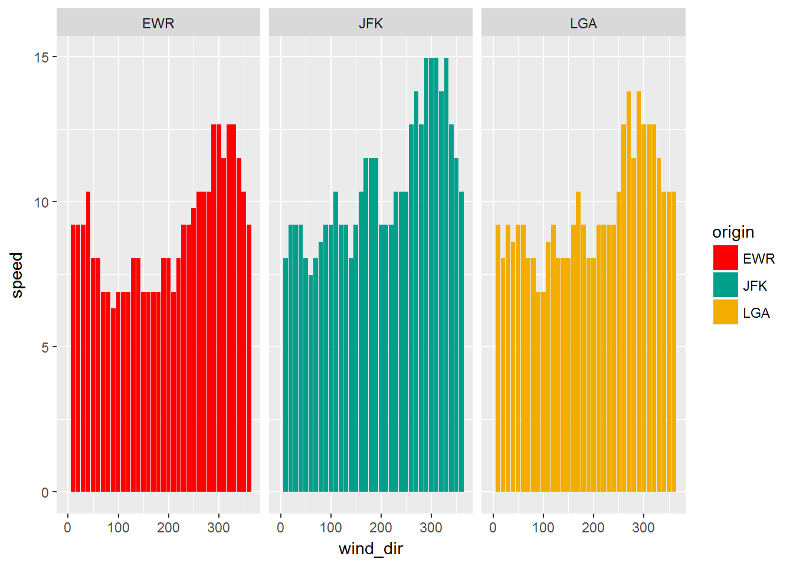
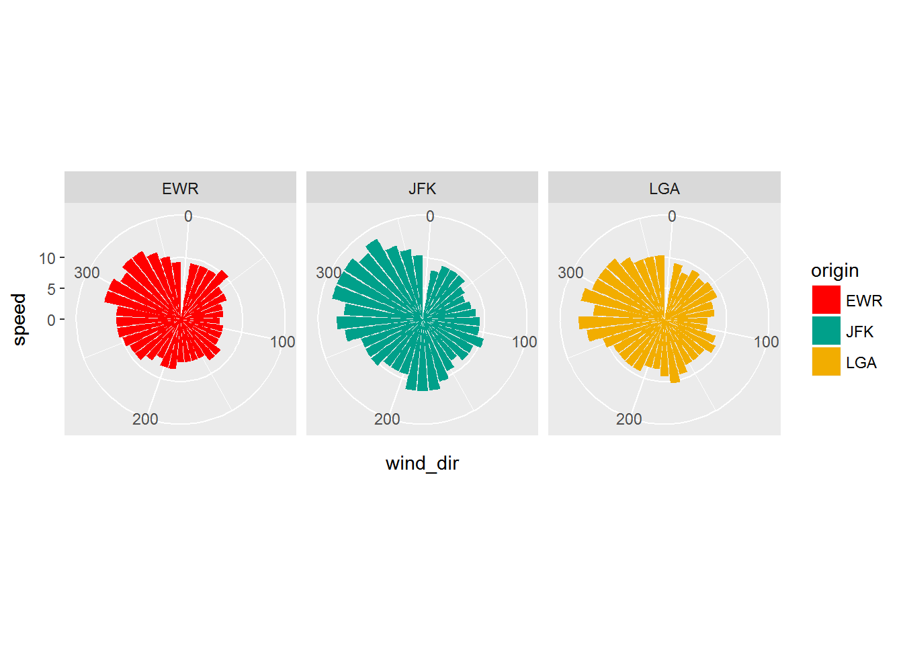
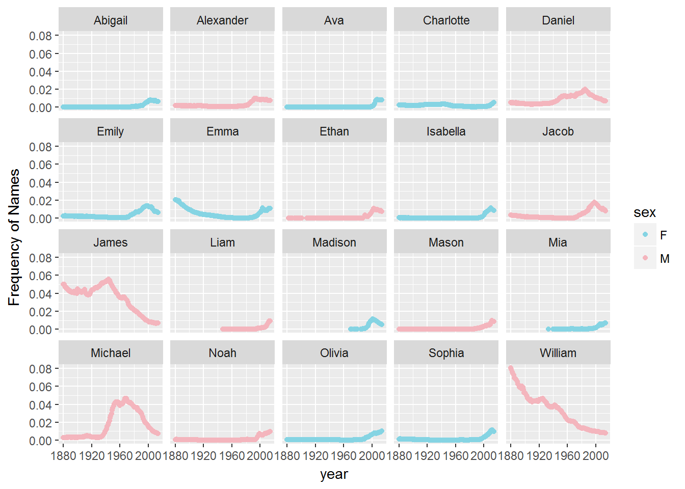
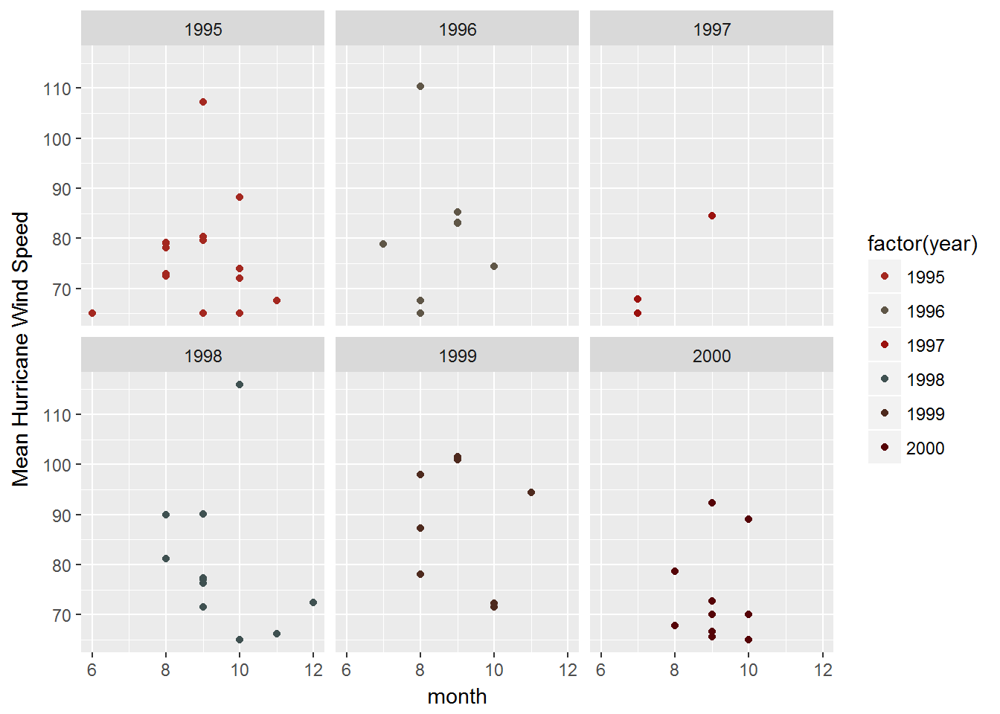

Prerequisites
-------------

Load in the tidyverse library:

    library(tidyverse)

    ## Loading tidyverse: ggplot2
    ## Loading tidyverse: tibble
    ## Loading tidyverse: tidyr
    ## Loading tidyverse: readr
    ## Loading tidyverse: purrr
    ## Loading tidyverse: dplyr

    ## Conflicts with tidy packages ----------------------------------------------

    ## filter(): dplyr, stats
    ## lag():    dplyr, stats

    library(wesanderson) #fun colour package based on his films. 

Load in the data sets:

    library(nycflights13)
    library(babynames)

    knitr::opts_chunk$set(
      fig.path = "images/"
    )

NYC Weather
-----------

**Question 1: Determine whether there are any clear outliers in wind
speed (wind\_speed) that should be rejected. If so, filter those bad
point(s) and proceed.**

Start by specifying which data set you will be using.

    nycflights13::weather

    ## # A tibble: 26,130 × 15
    ##    origin  year month   day  hour  temp  dewp humid wind_dir wind_speed
    ##     <chr> <dbl> <dbl> <int> <int> <dbl> <dbl> <dbl>    <dbl>      <dbl>
    ## 1     EWR  2013     1     1     0 37.04 21.92 53.97      230   10.35702
    ## 2     EWR  2013     1     1     1 37.04 21.92 53.97      230   13.80936
    ## 3     EWR  2013     1     1     2 37.94 21.92 52.09      230   12.65858
    ## 4     EWR  2013     1     1     3 37.94 23.00 54.51      230   13.80936
    ## 5     EWR  2013     1     1     4 37.94 24.08 57.04      240   14.96014
    ## 6     EWR  2013     1     1     6 39.02 26.06 59.37      270   10.35702
    ## 7     EWR  2013     1     1     7 39.02 26.96 61.63      250    8.05546
    ## 8     EWR  2013     1     1     8 39.02 28.04 64.43      240   11.50780
    ## 9     EWR  2013     1     1     9 39.92 28.04 62.21      250   12.65858
    ## 10    EWR  2013     1     1    10 39.02 28.04 64.43      260   12.65858
    ## # ... with 26,120 more rows, and 5 more variables: wind_gust <dbl>,
    ## #   precip <dbl>, pressure <dbl>, visib <dbl>, time_hour <dttm>

We are only interested in the wind speed and direction. Simplify the
data set by removing the excess rows.

    wind <- nycflights13::weather %>%
      select(origin, wind_dir, wind_speed)
    head(wind)

    ## # A tibble: 6 × 3
    ##   origin wind_dir wind_speed
    ##    <chr>    <dbl>      <dbl>
    ## 1    EWR      230   10.35702
    ## 2    EWR      230   13.80936
    ## 3    EWR      230   12.65858
    ## 4    EWR      230   13.80936
    ## 5    EWR      240   14.96014
    ## 6    EWR      270   10.35702

Visualize the data to get a rough idea of any outliers present. Use a
box plot.

    ggplot(wind)+geom_boxplot(aes(x=origin,y=wind_speed))+ylab('Wind Speed')

    ## Warning: Removed 3 rows containing non-finite values (stat_boxplot).

We can see that there is wind speed over 1000. Let's filter that point
out.

    wind_filter <- wind %>%
      filter(wind_speed<1000)
    head (wind_filter)

    ## # A tibble: 6 × 3
    ##   origin wind_dir wind_speed
    ##    <chr>    <dbl>      <dbl>
    ## 1    EWR      230   10.35702
    ## 2    EWR      230   13.80936
    ## 3    EWR      230   12.65858
    ## 4    EWR      230   13.80936
    ## 5    EWR      240   14.96014
    ## 6    EWR      270   10.35702

Plot the filtered wind data to see if there are any more outliers.

    ggplot(wind_filter)+geom_boxplot(aes(x=origin,y=wind_speed))+ylab('Wind Speed')

Now we have a more clear view with no more obvious outliers.

**Question 2: What direction has the highest median speed at each
airport? Make a table and a plot of median wind speed by direction, for
each airport.**

Need to find the median wind speed for each direction, sorted by the
three airports. Use the SPLIT-APPLY-COMBINE approach. SPLIT the data in
two ways, airport and wind direction. APPLY the median function to the
groups. COMBINE into a table showing 3 columns.

    median <- wind_filter %>%
      group_by(origin, wind_dir) %>% #SPLIT into groups
      summarize (
        speed=median(wind_speed, na.rm=TRUE) #APPLY the median function to these groups
      )
     #COMBINE is the output table of the median data frame 
    median

    ## Source: local data frame [114 x 3]
    ## Groups: origin [?]
    ## 
    ##    origin wind_dir    speed
    ##     <chr>    <dbl>    <dbl>
    ## 1     EWR        0  0.00000
    ## 2     EWR       10  9.20624
    ## 3     EWR       20  9.20624
    ## 4     EWR       30  9.20624
    ## 5     EWR       40 10.35702
    ## 6     EWR       50  8.05546
    ## 7     EWR       60  8.05546
    ## 8     EWR       70  6.90468
    ## 9     EWR       80  6.90468
    ## 10    EWR       90  6.32929
    ## # ... with 104 more rows

Now we need to plot this data.

Plot a basic graph

    bar <- ggplot(median, aes(x=wind_dir, y=speed, fill=origin)) + 
      facet_wrap(~origin)+geom_bar(stat = "identity")+
      scale_fill_manual(values=wes_palette(n=3, name="Darjeeling"))
    print(bar)

    ## Warning: Removed 3 rows containing missing values (position_stack).

Now plot as wind rose

    rose <- bar+coord_polar()
    print(rose)

    ## Warning: Removed 3 rows containing missing values (position_stack).

NYC Flights and Airlines
------------------------

**Question 3: Make a table with two columns: airline name (not carrier
code) and median distance flown from JFK airport. The table should be
arranged in order of decreasing mean flight distance. **

Preview the data

    nycflights13::flights

    ## # A tibble: 336,776 × 19
    ##     year month   day dep_time sched_dep_time dep_delay arr_time
    ##    <int> <int> <int>    <int>          <int>     <dbl>    <int>
    ## 1   2013     1     1      517            515         2      830
    ## 2   2013     1     1      533            529         4      850
    ## 3   2013     1     1      542            540         2      923
    ## 4   2013     1     1      544            545        -1     1004
    ## 5   2013     1     1      554            600        -6      812
    ## 6   2013     1     1      554            558        -4      740
    ## 7   2013     1     1      555            600        -5      913
    ## 8   2013     1     1      557            600        -3      709
    ## 9   2013     1     1      557            600        -3      838
    ## 10  2013     1     1      558            600        -2      753
    ## # ... with 336,766 more rows, and 12 more variables: sched_arr_time <int>,
    ## #   arr_delay <dbl>, carrier <chr>, flight <int>, tailnum <chr>,
    ## #   origin <chr>, dest <chr>, air_time <dbl>, distance <dbl>, hour <dbl>,
    ## #   minute <dbl>, time_hour <dttm>

    nycflights13::airlines

    ## # A tibble: 16 × 2
    ##    carrier                        name
    ##      <chr>                       <chr>
    ## 1       9E           Endeavor Air Inc.
    ## 2       AA      American Airlines Inc.
    ## 3       AS        Alaska Airlines Inc.
    ## 4       B6             JetBlue Airways
    ## 5       DL        Delta Air Lines Inc.
    ## 6       EV    ExpressJet Airlines Inc.
    ## 7       F9      Frontier Airlines Inc.
    ## 8       FL AirTran Airways Corporation
    ## 9       HA      Hawaiian Airlines Inc.
    ## 10      MQ                   Envoy Air
    ## 11      OO       SkyWest Airlines Inc.
    ## 12      UA       United Air Lines Inc.
    ## 13      US             US Airways Inc.
    ## 14      VX              Virgin America
    ## 15      WN      Southwest Airlines Co.
    ## 16      YV          Mesa Airlines Inc.

Need to find the key, the variable used to connect each pair of tables.
In this case it is *carrier*. I will use a left join that will keep all
observations in the flights data.

    flights2 <- nycflights13::flights %>% #define the data set you are using
      left_join(nycflights13::airlines, by="carrier") %>% #join the data frames using "carrier" as the key
      filter(origin == "JFK") %>% #filter for planes that left JFK
      arrange(desc(distance)) %>% #arrange in order of decreasing mean flight distance
      select(name, distance)  #keep only these two columns
    head (flights2) #preview new table, shhowing first 5 rows 

    ## # A tibble: 6 × 2
    ##                     name distance
    ##                    <chr>    <dbl>
    ## 1 Hawaiian Airlines Inc.     4983
    ## 2 Hawaiian Airlines Inc.     4983
    ## 3 Hawaiian Airlines Inc.     4983
    ## 4 Hawaiian Airlines Inc.     4983
    ## 5 Hawaiian Airlines Inc.     4983
    ## 6 Hawaiian Airlines Inc.     4983

**Question 4: Make a wide-format data frame that displays the number of
flights that leave Newark ("EWR") airport each month, from each
airline.**

Will need to use the SPLIT-APPLY-COMBINE approach. SPLIT the flight data
into groups based on airlines and month and filter to only use EWR data,
APPLY the mean function to the data, COMBINE the data into a wide format
table. Will need to use the spread() function as it makes long tables
shorter and wider.

    EWR<- nycflights13::flights%>% #define the data set you are using
      filter(origin == "EWR") %>% #filter for planes that left EWR
      group_by(carrier, month) %>% #Split into groups based on month and carrier
      summarize(n=n()) #apply a count function to the groups
    EWR #look at the table

    ## Source: local data frame [131 x 3]
    ## Groups: carrier [?]
    ## 
    ##    carrier month     n
    ##      <chr> <int> <int>
    ## 1       9E     1    82
    ## 2       9E     2    75
    ## 3       9E     3    91
    ## 4       9E     4    88
    ## 5       9E     5   103
    ## 6       9E     6    88
    ## 7       9E     7    94
    ## 8       9E     8    96
    ## 9       9E     9    87
    ## 10      9E    10   146
    ## # ... with 121 more rows

The output table is in long format, need to convert to wide format using
months. Use the spread function. Months is the key. Specify that we want
to split the count data, the "n" column.

    EWR_month<-spread(EWR,key=month, n)
    EWR_month

    ## Source: local data frame [12 x 13]
    ## Groups: carrier [12]
    ## 
    ##    carrier   `1`   `2`   `3`   `4`   `5`   `6`   `7`   `8`   `9`  `10`
    ## *    <chr> <int> <int> <int> <int> <int> <int> <int> <int> <int> <int>
    ## 1       9E    82    75    91    88   103    88    94    96    87   146
    ## 2       AA   298   268   295   288   297   291   303   302   282   292
    ## 3       AS    62    56    62    60    62    60    62    62    60    62
    ## 4       B6   573   532   612   567   517   506   546   544   478   501
    ## 5       DL   279   249   319   364   377   347   340   355   423   440
    ## 6       EV  3838  3480  3996  3870  4039  3661  3747  3636  3425  3587
    ## 7       MQ   212   196   228   220   226   218   228   227   214   140
    ## 8       OO    NA    NA    NA    NA    NA     2    NA    NA    NA    NA
    ## 9       UA  3657  3433  3913  4025  3874  3931  4046  4050  3573  3875
    ## 10      US   363   328   372   361   381   390   402   385   341   365
    ## 11      VX    NA    NA    NA   170   186   180   181   182   161   170
    ## 12      WN   529   490   532   518   530   501   526   520   506   526
    ## # ... with 2 more variables: `11` <int>, `12` <int>

Baby Names
----------

**Question 5: Identify the ten most common male and female names in
2014. Make a plot of their frequency (prop) since 1880. (This may
require two separate piped statements).**

Start by previewing the data

    head(babynames)

    ## # A tibble: 6 × 5
    ##    year   sex      name     n       prop
    ##   <dbl> <chr>     <chr> <int>      <dbl>
    ## 1  1880     F      Mary  7065 0.07238359
    ## 2  1880     F      Anna  2604 0.02667896
    ## 3  1880     F      Emma  2003 0.02052149
    ## 4  1880     F Elizabeth  1939 0.01986579
    ## 5  1880     F    Minnie  1746 0.01788843
    ## 6  1880     F  Margaret  1578 0.01616720

First determine top 10 baby names in 2014:

    top10 <- babynames %>%
      filter(year==2014)%>% #isolate baby names from 2014
      group_by(sex)%>% #group by sex to get top 10 in this format
      top_n(10,n) %>%#select the top 10 values in the count colmn, n
      rename(sex2 = sex)%>% #renamind sex column becuase it will make it easier to join in next step
     select(name,sex2)  #only intrested in the name and sex, will keep only one col, it will make it easier for the next step below

I now have a data frame of top 10 names. I can merge it with the
babynames data frame using a left join with top 10 as the primary data
frame. This will ensure that only the names that appear in the top ten
will be preserved. Need to eliminate the prop column.

    top10_all<-top10%>%
      left_join(babynames, by="name", na.rm=TRUE)
    top10_all

    ## Source: local data frame [3,753 x 6]
    ## Groups: sex2 [?]
    ## 
    ##     name  sex2  year   sex     n         prop
    ##    <chr> <chr> <dbl> <chr> <int>        <dbl>
    ## 1   Emma     F  1880     F  2003 2.052149e-02
    ## 2   Emma     F  1880     M    10 8.445946e-05
    ## 3   Emma     F  1881     F  2034 2.057538e-02
    ## 4   Emma     F  1881     M     9 8.311477e-05
    ## 5   Emma     F  1882     F  2303 1.990527e-02
    ## 6   Emma     F  1882     M     7 5.736153e-05
    ## 7   Emma     F  1883     F  2367 1.971449e-02
    ## 8   Emma     F  1883     M     7 6.223329e-05
    ## 9   Emma     F  1884     F  2587 1.880251e-02
    ## 10  Emma     F  1884     M     9 7.332513e-05
    ## # ... with 3,743 more rows

Apparently people gave traditionally female names to males in some years
and I will need to filter these out. Will apply a conditional filter so
that I can remove rows where sex2 does not equal sex.

    top10_mf<-top10%>%
      left_join(babynames, by="name")%>%
      filter(sex2==sex)

Now that we have our data set lets plot!

    name_plot<-ggplot(top10_mf, aes(x=year,y=prop, colour=sex))+
      geom_point()+
      ylab("Frequency of Names")+
      facet_wrap(~name)+
      scale_color_manual(values = wes_palette("Moonrise3")) 
    print(name_plot)

**Question 6: Make a single table of the 26th through 29th most common
girls names in the year 1896, 1942, and 2016**

    girl_names<-babynames%>%
      filter(sex=="F", year==1896|year==1942|year==2014)%>% #filter the rows for all female names and for the specified years
      group_by(year)%>% #create a group for each year
      mutate(rank = dense_rank(desc(n)))%>%#add a column that assigns a rank to the count column, used dense so that there is no gaps between ranks
    filter((rank > 25) & (rank < 30)) #filter again so that only the rank 26, 27, 28, 29 are displayed
    girl_names

    ## Source: local data frame [13 x 6]
    ## Groups: year [3]
    ## 
    ##     year   sex     name     n        prop  rank
    ##    <dbl> <chr>    <chr> <int>       <dbl> <int>
    ## 1   1896     F   Martha  2022 0.008023969    26
    ## 2   1896     F   Esther  1964 0.007793805    27
    ## 3   1896     F  Frances  1964 0.007793805    27
    ## 4   1896     F    Edith  1932 0.007666819    28
    ## 5   1896     F   Myrtle  1928 0.007650945    29
    ## 6   1942     F    Helen 10014 0.007202575    26
    ## 7   1942     F  Marilyn  9904 0.007123458    27
    ## 8   1942     F    Diane  9550 0.006868843    28
    ## 9   1942     F   Martha  9513 0.006842231    29
    ## 10  2014     F Brooklyn  6767 0.003490782    26
    ## 11  2014     F     Lily  6727 0.003470148    27
    ## 12  2014     F   Hannah  6512 0.003359240    28
    ## 13  2014     F    Layla  6428 0.003315908    29

Weather Data
------------

**Question 7: Write task that involves some of the functions on the Data
Wrangling Cheat Sheet and execute it.\* You may either use your own data
or data packages (e.g., the ones listed here).**

Load in the NASA Weather data

    library(nasaweather)

This package contains four datasets:

atmos: atmospheric measurements elev: elevations borders: borders of
countries in the region storms: tracks of tropical storms

We will work the storm dataset:

    nasaweather::storms

    ## # A tibble: 2,747 × 11
    ##       name  year month   day  hour   lat  long pressure  wind
    ##      <chr> <int> <int> <int> <int> <dbl> <dbl>    <int> <int>
    ## 1  Allison  1995     6     3     0  17.4 -84.3     1005    30
    ## 2  Allison  1995     6     3     6  18.3 -84.9     1004    30
    ## 3  Allison  1995     6     3    12  19.3 -85.7     1003    35
    ## 4  Allison  1995     6     3    18  20.6 -85.8     1001    40
    ## 5  Allison  1995     6     4     0  22.0 -86.0      997    50
    ## 6  Allison  1995     6     4     6  23.3 -86.3      995    60
    ## 7  Allison  1995     6     4    12  24.7 -86.2      987    65
    ## 8  Allison  1995     6     4    18  26.2 -86.2      988    65
    ## 9  Allison  1995     6     5     0  27.6 -86.1      988    65
    ## 10 Allison  1995     6     5     6  28.5 -85.6      990    60
    ## # ... with 2,737 more rows, and 2 more variables: type <chr>,
    ## #   seasday <int>

I like the hurricane dataset the best. Let's see what month has the most
powerful (based on wind speed) hurricanes between 1995 and 2000.

    storms<-nasaweather::storms%>%
      filter(type=="Hurricane")%>% #only want hurricanes, not tropical storms
      group_by(month,name,year)%>%
      summarize(mean_speed=mean(wind)) #apply a count function to the groups)
    storms

    ## Source: local data frame [55 x 4]
    ## Groups: month, name [?]
    ## 
    ##    month     name  year mean_speed
    ##    <int>    <chr> <int>      <dbl>
    ## 1      6  Allison  1995   65.00000
    ## 2      7   Bertha  1996   78.86364
    ## 3      7     Bill  1997   65.00000
    ## 4      7    Danny  1997   67.85714
    ## 5      8  Alberto  2000   78.61702
    ## 6      8   Bonnie  1998   90.00000
    ## 7      8     Bret  1999   98.00000
    ## 8      8    Cindy  1999   87.29167
    ## 9      8 Danielle  1998   81.15385
    ## 10     8    Debby  2000   67.77778
    ## # ... with 45 more rows

Plot the data:

    storm_plot<-ggplot(storms,aes(x=month, y=mean_speed, group=factor(year), color=factor(year)))+
      geom_point()+
      ylab("Mean Hurricane Wind Speed")+facet_wrap(~year)+
      scale_color_manual(values = wes_palette("BottleRocket")) 
    print(storm_plot)

