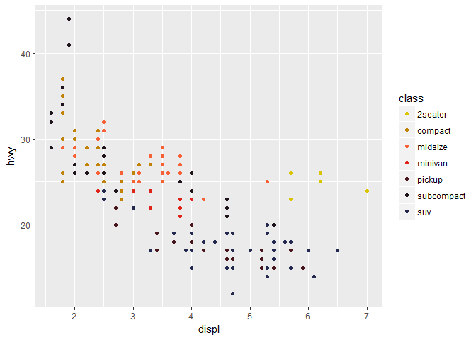
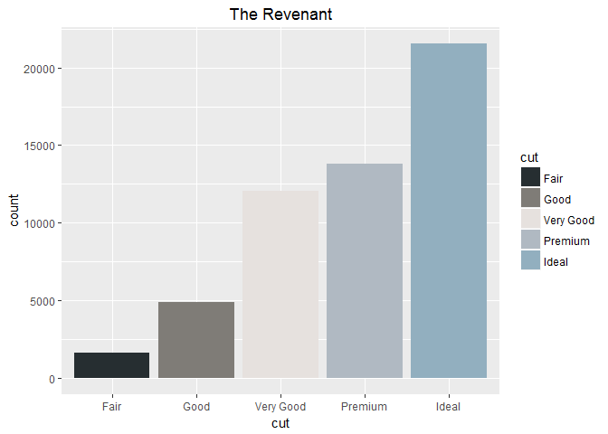
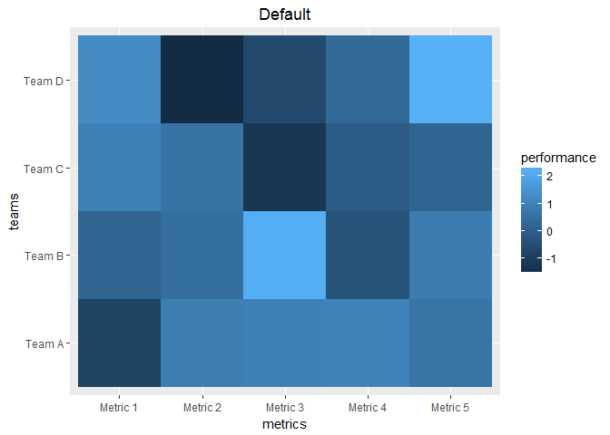
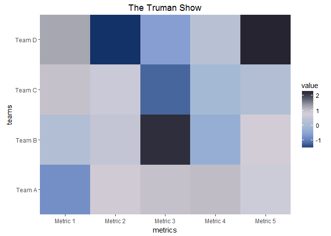

Goal of Package
---------------

The goal is to create a package similar to the wesanderson package where you can give your plots a colour theme based off of film palettes.

Set up
======

``` r
#Save all Images
knitr::opts_chunk$set(
  fig.path = "figure-markdown_github/"
)
```

Colour Palettes
---------------

I have used this website to look at the colours of iconic films: <http://www.esquire.com/style/news/g2760/color-palettes-iconic-films/>

To get the hex code of these colours I used this website: <http://www.color-hex.com/>

My username on the colour website is emilynield. I have all the palettes hosted on that site.

``` r
film_palettes <- list(
  
Akira = c("#115363", "#9C3111", "#5C4454", "#7EA228", "#7E2835", "#756B30", "#03182D", "#9D0500", "#1A3330", "#1F2549"),
Alice=c("#C98011", "#CD595A", "#750416", "#632115", "#A83904", "#BD654D", "#CBAA99", "#9A9460", "#845F0E", "#312F1A"),
Alien=c("#0B3241", "#445766", "#AFBBCB", "#D4D9DC", "#B7A2A1", "#764B55", "#362724"),
Amelie=c("#361E02", "#7B3803", "#C5732A", "#561101", "#2A3A09", "#9F2F01"),
AmericanBeauty=c("#E2A8B4", "#AF6B84", "#78404B", "#4C2329", "#341211", "#2B0007", "#480001", "#7A0300", "#860315", "#B8133D"),
AmericanPsycho=c("#2D262D", "#69625A", "#707588", "#CCCEDD", "#FBEBEC", "#BCA196", "#6E4D48", "#442520", "#240E11"),
Anchorman=c("#334012", "#435C35", "#395175", "#4E79A4", "#B2CCFF", "#E7CBDA", "#A87469", "#5F3C38", "#251515"),
BigLebowski=c("#6A6D76", "#6F270E", "#272727", "#755347", "#9FA5E3", "#968F7F", "#455A5B", "#663E0B", "#825167", "#38394D"),
BladeRunner=c("#1F6C64", "#69C0B8", "#94B4B1", "#547FA2", "#223F6B", "#182132", "#3B2D47", "#65507B", "#936B85", "#6C3F42"),
BluesBrothers=c("#E4B379", "#C29F7F", "#907C73", "#655A62", "#483843", "#291E22", "#321D18", "#523B2D", "#917F71"),
BlueVelvet=c("#3F0C11", "#5A050C", "#79022A", "#971E54", "#E25B9E", "#FDA9DD", "#F4BCC7"),
BreakfastTiffanys=c("#484620", "#6E303B", "#A08687", "#680200", "#5A5A7E", "#6C473F", "#3F7A88"),
ClockworkOrange=c("#D8C500", "#C18103", "#F76035", "#DE2418", "#47161C", "#1E131B", "#23284E", "#2557D0", "#233C26"),
Deadpool=c("#3C0E11", "#5F262F", "#87515F", "#A28A8A", "#CACAD2", "#7F8595", "#34424F", "#131C23"),
EdwardScissorhands=c("#5B709B", "#B3897D", "#5F5D22", "#7C554E", "#F49987", "#C67DB4", "#A9A969", "#9593A0", "#F36E4B"),
EternalSunshine=c("#460008", "#774747", "#2F2935", "#B8B0AE", "#9C2831", "#C1A991", "#90604C", "#81747D"),
Fargo=c("#41494B", "#3C1414", "#FFBDCF", "#AA7B75", "#47423C", "#5C0806", "#E1ECFE", "#FE7A87"),
FearLoathing=c("#CD3D25", "#FFBE46", "#903F00", "#2F130F", "#5A5865", "#3E350C"),
FerrisBueller=c("#775B4D", "#F6C8B9", "#D6D9FA", "#2F3646", "#8695AA", "#495B67", "#0D0B10", "#817775"),
FightClub=c("#292B15", "#99D4E6", "#071619", "#5B1714", "#A69B6E", "#F2BE37", "#C0B9E5", "#30DDA7"),
HatefulEight=c("#352C1D", "#0052A4", "#B5BDA6", "#A88D00", "#172621", "#27130A", "#8C0501", "#6B5E18", "#4C4C42"),
Her=c("#2F2A27", "#544524", "#A3431B", "#8E5E38", "#862D1F", "#73643D" ,"#A06919", "#E4C9AE", "#46382D"),
Labyrinth=c("#535561", "#746D63", "#744B5B", "#403436", "#562E2F", "#7E5F64", "#3C2619", "#666A85", "#151316"),
LifePi=c("#5A4824", "#AB8D44", "#F0E186", "#FCDF1F", "#C58B0E", "#9F5410", "#9E3C17", "#BC3F09", "#B20405"),
LostTranslation=c("#512630", "#6E546F", "#A29BBD", "#DEDCF4", "#76809B", "#344358", "#080D20"),
MadMax=c("#0D646B", "#16383A", "#404740", "#B88F73", "#ED8F49", "#E27812", "#5C2A09", "#2E1612", "#0F1217"),
MeanGirls=c("#6D0216", "#8D0E45", "#A0356D", "#A75F8D", "#BDA0BF", "#887A9D", "#56507C", "#32243E", "#150F19"),
MoulinRouge=c("#E67701", "#AD4858", "#720A00", "#93066F", "#53399A", "#002992", "#4E6344"),
MrFox=c("#2F3332", "#818181", "#D6CBC7", "#C4A98E", "#CB974C", "#8C5C34", "#43290E", "#362F1F"),
NapoleonDynamite=c("#3B0F10", "#93645E", "#575F9D", "#C19733", "#9D3303", "#D1CDDC", "#4B3F3F", "#7C434A"),
PulpFiction=c("#060503", "#B88B61", "#EADAC3", "#720906", "#49413F", "#3E5BFF", "#323B36"),
ReservoirDogs=c("#513F4D", "#4E1B0A", "#2C191B", "#9B5766", "#4D577B", "#5B383C", "#DABBE5", "#A27F85"),
RockyHorror=c("#560300", "#844E28", "#D2A9A5", "#D7C4C8", "#1C1924", "#320D15", "#AC2300"),
Royal=c("#579913","#86704B", "#CE5D01", "#C3A978", "#D99300", "#210E08", "#6E522A"),
Rushmore=c("#1F2032", "#967566", "#788567", "#5F5D6A", "#4D2120", "#BE7C66", "#474644", "#283523", "#342721"),
ShopHorrors=c("#46411B", "#8F8315", "#AD8700", "#C67E8C", "#7D5939", "#8C4738", "#5A0103"),
SilenceLambs=c("#726554", "#371A16", "#A25E4B", "#C7BDBB", "#9F1B04", "#613613", "#7F3623", "#DCB8A2"),
StarWars=c("#495B83", "#2A2432", "#F46249", "#87758D", "#839DB4", "#4E321A", "#E5BFA8", "#96AE96"),
TaxiDriver=c("#271B1B", "#ADA4A7", "#5D474A", "#443A31", "#735D34", "#784542", "#847A83", "#AB938F", "#5A5F3F"),
TheGodfather=c("#4F2A17", "#844D14", "#1C1B17", "#CFBF9D", "#BF2316", "#EBAE5E", "#B7801C","#4B3C1D"),
ThelmaLouise=c("#313534", "#B47B9E", "#7C585C", "#9893BC", "#67161D", "#472C17", "#6D695E", "#CA927B", "#8898B1", "#5F7753"),
TheMatrix=c("#1C2F2D", "#334745", "#60807B", "#7A9A85", "#9DBEB3", "#C1D6C3", "#DCEEF0"),
TheProfessional=c("#B4775B", "#AD3429", "#6B140B", "#B65D35", "#C09129", "#464E29", "#9C8C73", "#3D4753", "#040001"),
TheRevenant=c("#262E31", "#7F7C77", "#E6E1DE", "#B0B9C2", "#92AFBF", "#4F8BA7", "#103E55"),
TheShining=c("#0D0A03", "#5C0D08", "#A06F5E", "#2D3743", "#564531", "#A33D15", "#698A91", "#3B5E36", "#F79787"),
TrumanShow=c("#133268", "#5776AD", "#869DD3", "#A1B9D5", "#BAC1D3", "#D7D1DB", "#A6A6B0", "#585D70", "#262431"),
TopGun=c("#180D07", "#3C1808", "#785A38", "#F2D87B", "#D1992C", "#C0590E", "#760E0F", "#04163C", "
#1F4FED"),
WestSideStory=c("#867482", "#1B1821", "#847649", "#8A90A8", "#74474C", "#46413E", "#5D1628", "#322626"),
WolfWallStreet=c("#745054", "#56292C", "#A78265", "#600D29", "#5E2C23", "#E8D3C2", "#B57F75", "#624352", "#11131F"),
Zissou=c("#6B6C5A", "#84849E", "#3F6490", "#1F143F", "#990600", "#460203", "#24100F")


)
```

Colour Function
---------------

Now that I have my list of colours I need to create a function. I want this to work on both a continuous and a discreet level. It is naturally set yp for discreet but if you need more colours than what the palette can offefr you then you can interpolate between existing colours to get a continous palette.

``` r
film_palette <- function(name, n, type = c("discrete", "continuous")) {
  type <- match.arg(type)

  pal <- film_palettes[[name]] #add an error in case you can't find the name of the palette
  if (is.null(pal))
    stop("Palette not found.")

  if (missing(n)) {
    n <- length(pal)
  }

  if (type == "discrete" && n > length(pal)) {
    stop("Number of requested colors greater than what palette can offer") #add an error if person is using discreet but there are not enough colour options in that palette
  }

  out <- switch(type,
    continuous = colorRampPalette(pal)(n),
    discrete = pal[1:n]
  )
  structure(out, class = "palette", name = name)
}
```

Export palette

``` r
#' @export
print.palette <- function(x, ...) {
  n <- length(x)
  old <- par(mar = c(0.5, 0.5, 0.5, 0.5))
  on.exit(par(old))

  image(1:n, 1, as.matrix(1:n), col = x,
    ylab = "", xaxt = "n", yaxt = "n", bty = "n")

  rect(0, 0.9, n + 1, 1.1, col = rgb(1, 1, 1, 0.8), border = NA)
  text((n + 1) / 2, 1, labels = attr(x, "name"), cex = 1, family = "serif")
}
```

Examples
--------

Let's test out our new palette. Load in ggplot and play around with some of the data packages.

``` r
library(ggplot2)
```

Plot the mtcars package. You will need to add an aditional line in the ggplot to specify which palette to use

``` r
ggplot(data=mpg)+geom_point(mapping=aes(x=displ, y=hwy, color=class))+ 
  scale_color_manual(values = film_palette("ClockworkOrange")) 
```



Play around with the diamonds data set. We will plot the same graph but with various movie palettes.

Default:

``` r
ggplot(data=diamonds)+
  geom_bar(mapping=aes(cut, fill=cut))+
  ggtitle("ggplot Default colours")+
  theme(plot.title = element_text(hjust = 0.5))
```


Clockwork Orange:

``` r
ggplot(data=diamonds)+
  geom_bar(mapping=aes(cut, fill=cut))+ 
  scale_fill_manual(values = film_palette("ClockworkOrange"))+
   ggtitle("Clockwork Orange")+
  theme(plot.title = element_text(hjust = 0.5))
```


Mean Girls:

``` r
ggplot(data=diamonds)+geom_bar(mapping=aes(cut, fill=cut))+ 
   scale_fill_manual(values = film_palette("MeanGirls"))+
   ggtitle("Mean Girls")+
  theme(plot.title = element_text(hjust = 0.5))
```


The Revenant:

``` r
ggplot(data=diamonds)+geom_bar(mapping=aes(cut, fill=cut))+ 
   scale_fill_manual(values = film_palette("TheRevenant"))+
   ggtitle("The Revenant")+
  theme(plot.title = element_text(hjust = 0.5))
```



The Rocky Horror Picture Show:

``` r
ggplot(data=diamonds)+geom_bar(mapping=aes(cut, fill=cut))+ 
   scale_fill_manual(values = film_palette("RockyHorror"))+
   ggtitle("The Rocky Horror Picture Show")+
  theme(plot.title = element_text(hjust = 0.5))
```


Let's try a continous example.

Making a heat map using this example: <https://www.r-bloggers.com/how-to-make-a-simple-heatmap-in-ggplot2/>

Create a data frame:

``` r
df.team_data <- expand.grid(teams = c("Team A", "Team B", "Team C", "Team D")
                           ,metrics = c("Metric 1", "Metric 2", "Metric 3", "Metric 4", "Metric 5")
                           )

# add variable: performance
set.seed(41)
df.team_data$performance <- rnorm(nrow(df.team_data))

#inspect
head(df.team_data)
```

    ##    teams  metrics performance
    ## 1 Team A Metric 1  -0.7943683
    ## 2 Team B Metric 1   0.1972575
    ## 3 Team C Metric 1   1.0017043
    ## 4 Team D Metric 1   1.2888254
    ## 5 Team A Metric 2   0.9057534
    ## 6 Team B Metric 2   0.4936675

``` r
#Plot Normally
ggplot(data = df.team_data, aes(x = metrics, y = teams)) +
  geom_tile(aes(fill = performance)) +
   ggtitle("Default")+
  theme(plot.title = element_text(hjust = 0.5))
```



``` r
pal <- film_palette("TrumanShow", 100, type = "continuous")

ggplot(data = df.team_data, aes(x = metrics, y = teams, fill = value)) +
  geom_tile(aes(fill = performance)) + 
  scale_fill_gradientn(colours = pal) + 
  scale_x_discrete(expand = c(0, 0)) +
  scale_y_discrete(expand = c(0, 0)) + 
  coord_equal()+
   ggtitle("The Truman Show")+
  theme(plot.title = element_text(hjust = 0.5))
```



Conclusion
----------

I now having a working piece of code that can be developed into a package. As per task requirements, this will be uploaded on to it's repository on GitHub. I will call it Film Palettes instead of Task 9 so that it is easy for other people to download and use it.
